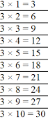

# Laço de repetição + Array

### Calculadora
- Faça um programa que receba um número inteiro, depois será solicitado para escolher uma das seguintes opções:
    - 1 Adição
    - 2 Multiplicação
    - 3 Subtração
    - 4 Divisão
    - 5 Sair
- Para escolher a opção, basta digitar o número correspondente. Feito isso, deve exibir a tabuada completa do número e da opção selecionada. 
- O programa só será encerrado, se a pessoa digitar o número 5.
- Exemplo para uma entrada do número 3 e da escolha da opção 2, sua saída será conforme a imagem abaixo:

----------------------------------------------------
### Par ou Ímpar
- Faça um programa que construa uma matriz 3 linhas e 3 colunas contendo números inteiros. 
- Em seguida escreva a soma dos elementos de cada linha e se a soma dos elementos é par ou impar. 
- Por fim escreva a soma dos elementos de cada coluna e se a soma dos elementos é par ou impar.
----------------------------------------------------
### Diagonal principal
- Faça um programa que construa uma matriz 3 por 3 de números reais e depois de construída, colocar o conteúdo de sua diagonal principal dentro de um vetor e depois do vetor montado, imprimir o vetor.

